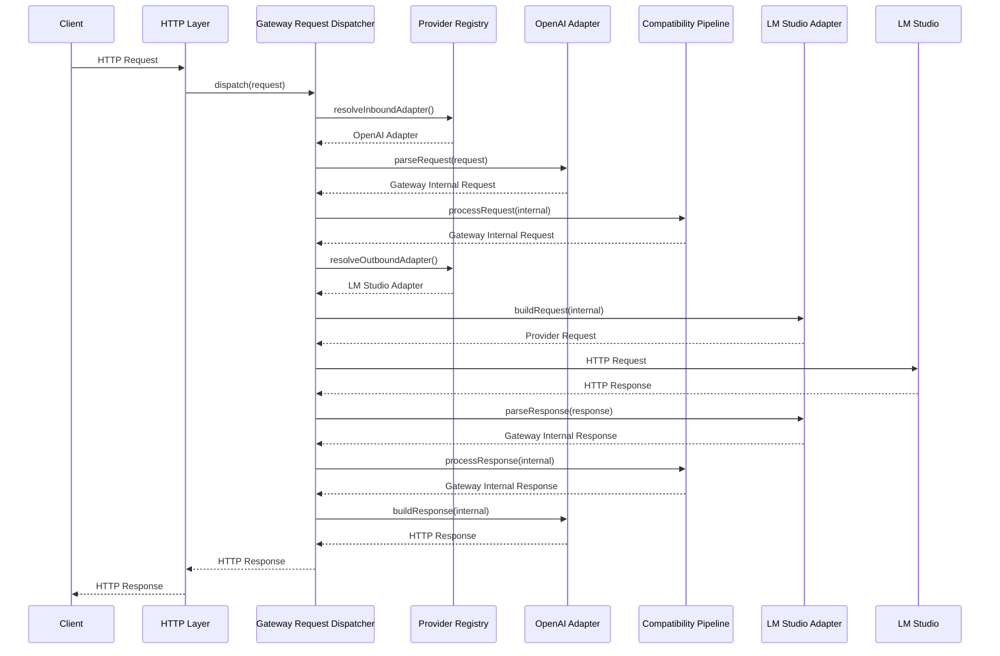
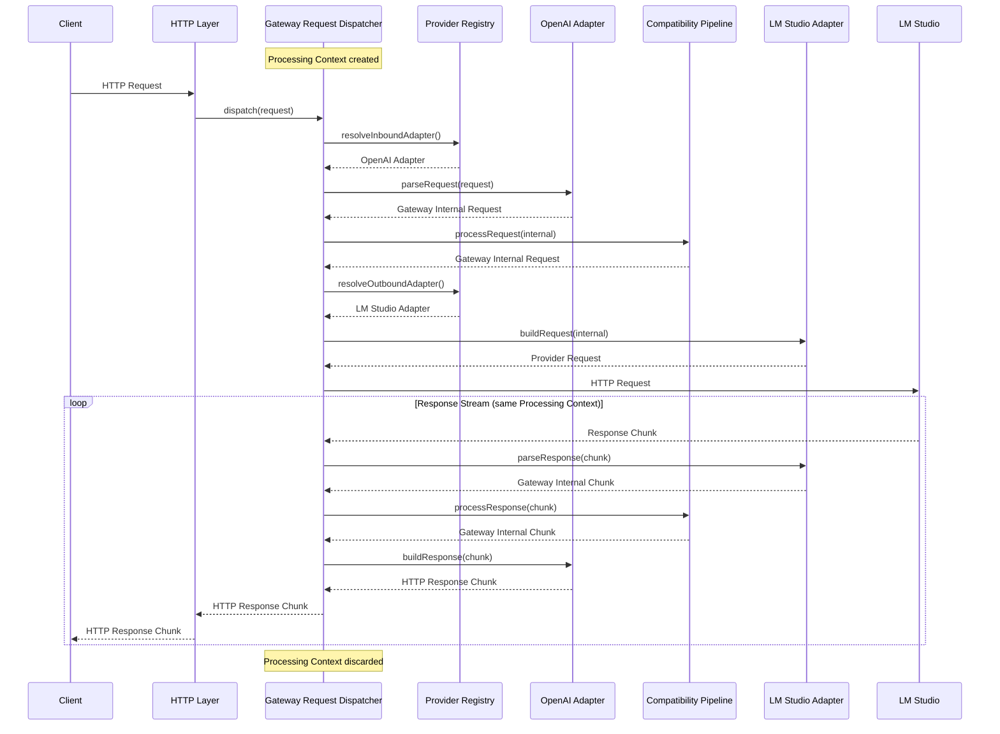

# Request Flow

## Purpose

Describe how AI Gateway processes requests throughout their lifecycle.

This document focuses on the execution flow and responsibilities of each
component.

See also:

- internal-model.md
- compatibility-pipeline.md

---

# Request Lifecycle

A request is processed in the following stages.

1. Receive an HTTP request.
2. Resolve the inbound adapter through the Provider Registry.
3. Convert the client request into the Gateway Internal Model via `parseRequest()`.
4. Execute the Compatibility Pipeline on the request.
5. Resolve the outbound adapter through the Provider Registry.
6. Convert the Gateway Internal Model into the destination provider request via `buildRequest()`.
7. Send the request to the provider.
8. Receive the provider response.
9. Convert the provider response into the Gateway Internal Model via `parseResponse()`.
10. Execute the Compatibility Pipeline on the response.
11. Convert the Gateway Internal Model into the client response via `buildResponse()`.
12. Return the HTTP response.

---

# Standard Execution Flow

## Non-streaming Request

---

## Streaming Request

The request phase is identical to the non-streaming request.

During response processing, a single Processing Context is created at request
time and shared across all response chunks for the duration of the stream.
Each chunk flows through `parseResponse()` → Compatibility Pipeline →
`buildResponse()` independently, but always within the same context.
The Processing Context is discarded only when the stream completes or an error
occurs.

---

# Processing Context Lifecycle

A Processing Context is created by the Gateway Request Dispatcher at the start
of each request.

The same Processing Context is shared across:

- Inbound adapter `parseRequest()`
- Request Compatibility Pipeline (`processRequest`)
- Outbound adapter `buildRequest()`
- Provider communication
- Outbound adapter `parseResponse()`
- Response Compatibility Pipeline (`processResponse`)
- Inbound adapter `buildResponse()`

For streaming responses, the same Processing Context is reused for every
response chunk throughout the entire stream lifecycle. This allows compatibility
modules to maintain state — such as namespace mappings or rewritten tool names —
across request and all subsequent response chunks.

The Processing Context is discarded when:

- The full response has been processed (non-streaming).
- The streaming response completes successfully.
- An error occurs during processing.

---

# Component Responsibilities

## HTTP Layer

Responsible for:

- Receiving HTTP requests
- Returning HTTP responses
- Streaming responses
- HTTP-specific error handling

---

## Gateway Request Dispatcher

Responsible for:

- Orchestrating request execution
- Resolving adapters through the Provider Registry (`resolveInboundAdapter`, `resolveOutboundAdapter`)
- Invoking adapter methods (`parseRequest`, `buildRequest`, `parseResponse`, `buildResponse`)
- Invoking the Compatibility Pipeline (`processRequest`, `processResponse`)
- Managing the Processing Context lifecycle
- Coordinating provider communication

---

## Provider Registry

Responsible for:

- Registering available Provider Adapters
- Resolving adapters by provider identifier (`resolveInboundAdapter`, `resolveOutboundAdapter`)

---

## Provider Adapter

Responsible for:

- Parsing provider-specific requests into the Gateway Internal Model (`parseRequest`)
- Building provider-specific requests from the Gateway Internal Model (`buildRequest`)
- Parsing provider-specific responses into the Gateway Internal Model (`parseResponse`)
- Building provider-specific responses from the Gateway Internal Model (`buildResponse`)
- Converting between provider payloads and the Gateway Internal Model

---

## Compatibility Pipeline

Responsible for:

- Executing Compatibility Modules
- Applying compatibility transformations
- Evaluating Provider Capability

---

## Compatibility Module

Responsible for:

- A single compatibility transformation
- Reading Provider Capability
- Reading and updating Processing Context

Modules are independent and are executed only by the Compatibility Pipeline.

---

# Execution Variants

The standard execution flow may be extended by specialized processing flows.

Examples include:

- Function Calling
- Tool Calling
- Image Generation
- Future protocol extensions

Additional sequence diagrams may be added as these features are implemented.

---

# Related Documents

- internal-model.md
- compatibility-pipeline.md
